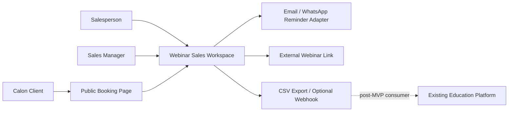
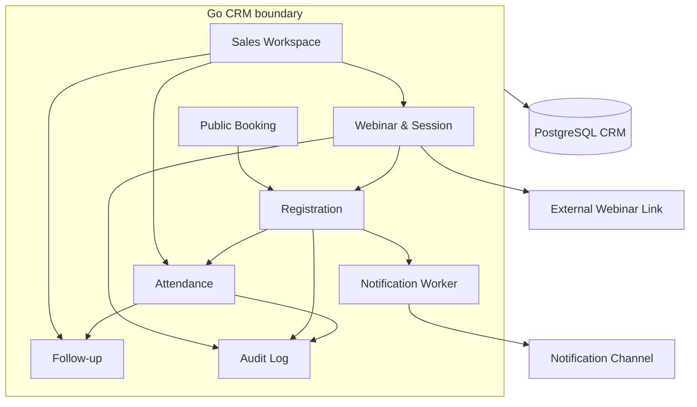

# Visi Arsitektur

## North star

CRM MVP adalah operating workspace untuk salesperson dalam menjalankan webinar produk: membuat sesi, menerima booking, mengingatkan peserta, mencatat kehadiran, lalu melakukan follow-up.

MVP tidak mencoba menyelesaikan seluruh sales funnel. Ia menghasilkan data peserta dan attendance yang bersih sebagai fondasi untuk voucher atau conversion pada fase berikutnya.

## Target context map



Platform pendidikan dan billing berada di luar runtime wajib MVP. Tidak ada call ke payment system pada journey booking atau attendance.

## Bounded context dan ownership

| Context | Owner | Tanggung jawab MVP |
|---|---|---|
| Webinar workspace | CRM | Event, session, host, capacity, publish/cancel status |
| Registration | CRM | Participant, booking, confirmation, cancellation, reschedule |
| Attendance | CRM | Attended/no-show, source, timestamp, operator |
| Follow-up | CRM | Owner, status, due date, note, outcome ringan |
| Notification delivery | CRM | Reminder schedule, attempt, delivery status, last error |
| Identity and learning | Existing platform | Di luar MVP; tetap memiliki user, organization, entitlement, dan learning access |
| Billing and payment | Existing billing | Di luar MVP; tetap memiliki invoice, payment, settlement, dan refund |

## Arsitektur Go MVP

```text
crm-api      public booking + internal salesperson API
crm-worker   reminder + scheduled cleanup + optional webhook delivery
PostgreSQL   webinar, registration, attendance, follow-up, notification job, audit
```

Satu repository dan satu database cukup. Boundary package digunakan agar scope tetap terjaga, bukan untuk mempersiapkan microservices secara berlebihan.

## Pola komunikasi

### Synchronous

- melihat sesi yang tersedia
- membuat booking dengan capacity check
- cancel atau reschedule registration
- mencatat attendance
- membuat follow-up task atau note
- mengambil dashboard dan export

### Asynchronous

- mengirim confirmation dan reminder
- retry notification yang transient failure
- menandai sesi selesai
- menerbitkan event webinar hanya jika consumer nyata sudah tersedia

Tidak perlu event bus pada MVP. PostgreSQL job table cukup untuk reminder dan retry awal.

## Prinsip arsitektur

1. **Webinar-first** - fitur harus mendukung journey webinar aktif, bukan roadmap masa depan.
2. **Salesperson-first** - dashboard mengikuti pekerjaan harian salesperson.
3. **Public flow is defensive** - capacity, duplicate, rate limit, dan data validation diterapkan pada booking.
4. **Timezone is explicit** - session disimpan dalam UTC dan selalu ditampilkan bersama timezone yang dipilih.
5. **Audit attendance changes** - perubahan hadir/no-show memiliki actor, waktu, sumber, dan alasan bila dikoreksi.
6. **No premature integration** - payment, voucher, dan provisioning tidak masuk runtime MVP.
7. **Future-compatible data** - simpan source/campaign reference dan stable registration ID tanpa mengimplementasikan benefit.
8. **Go simplicity** - gunakan standard library atau dependency tipis dan concurrency yang bounded/cancellable.

## Arsitektur logis



## Kualitas layanan awal

- Public booking p95 < 750 ms tanpa call provider eksternal.
- Capacity check dan insert registration terjadi atomik.
- Duplicate submit tidak menghasilkan registration kedua.
- Reminder job dapat di-retry dan status kegagalan terlihat.
- Semua waktu tersimpan dalam UTC dengan source timezone tercatat.
- Tidak ada data payment, password platform, atau data akademik di CRM.
