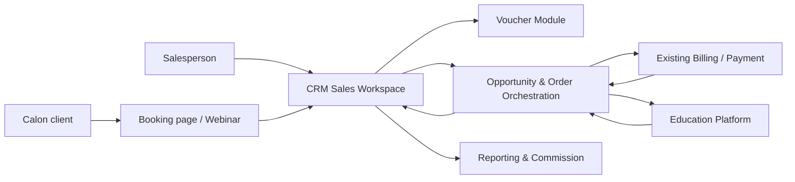
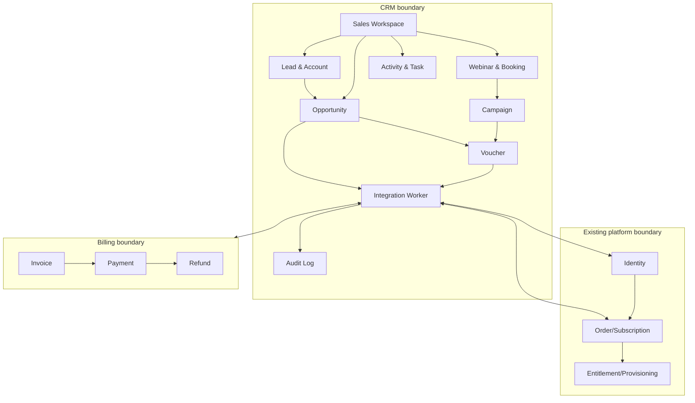

# Visi Arsitektur

## North star

CRM adalah operating system untuk pekerjaan salesperson: menemukan calon client, mengundang mereka ke webinar, mengelola follow-up, menerbitkan benefit, dan mengubah minat menjadi conversion yang dapat diatribusikan.

CRM tidak menjadi pusat seluruh data platform. Batas ini menjaga domain pembelajaran dan domain komersial dapat berkembang secara independen.

## Target context map



## Bounded context dan pemilik data

| Context | System of record | Tanggung jawab |
|---|---|---|
| Sales CRM | CRM | Lead, contact, commercial account, activity, task, webinar, campaign, attribution, opportunity |
| Voucher | CRM module / dedicated service later | Voucher rule, code/token, assignment, reservation, redemption, expiry, revocation |
| Identity and Learning | Existing platform | User identity, organization, role, membership, class, product entitlement, access |
| Order and Subscription | Existing platform or existing order service | SKU/package, quantity, price snapshot, order state, subscription state |
| Billing and Payment | Existing billing/payment | Invoice, payment attempt, settlement, refund, reconciliation |
| Integration | Platform capability | Event delivery, retry, deduplication, correlation, contract versioning |

## Evolusi deployment

Backend CRM menggunakan Go. Untuk platform yang sudah besar, domain CRM dipisahkan secara package dan memiliki database CRM sendiri sejak awal; deployment awal tetap berupa modular monolith agar tim tidak dibebani operasi microservices. Boundary tetap API-first sehingga Voucher atau Integration Service dapat diekstrak nanti.

```text
Tahap 1: Go crm-api + Go crm-worker + PostgreSQL CRM
Tahap 2: Voucher module dan webhook delivery dipisahkan bila load/ownership menuntut
Tahap 3: Event bus terkelola dan reporting read model terpisah
```

`crm-api` menangani request interaktif, public booking, dan webhook receiver. `crm-worker` menangani reminder, expiry, outbox delivery, inbox processing, dan reconciliation. Keduanya dibangun dari repository Go yang sama dan menggunakan business package yang sama.

## Pola komunikasi

### Synchronous API

Dipakai ketika salesperson atau checkout memerlukan keputusan segera:

- membuat booking
- mengecek kapasitas webinar
- validasi voucher
- reserve voucher
- membuat opportunity
- mengambil status organization atau subscription

### Asynchronous event/webhook

Dipakai untuk perubahan status dan side effect:

- `webinar.attendee.attended`
- `voucher.issued`
- `voucher.redeemed`
- `order.created`
- `payment.paid`
- `payment.refunded`
- `subscription.activated`
- `school.provisioned`

## Prinsip arsitektur

1. **Salesperson-first** - setiap fitur MVP dimulai dari job-to-be-done salesperson.
2. **Single owner per fact** - satu fakta bisnis memiliki satu pemilik; sistem lain menyimpan referensi atau read model.
3. **API contract-first** - kontrak versi `v1` dan consumer-driven contract test sebelum implementasi produksi.
4. **Eventual consistency dengan status yang terlihat** - CRM boleh terlambat menerima status platform, tetapi status sync dan waktu terakhir harus terlihat.
5. **Idempotent by default** - retry webhook atau user refresh tidak boleh menggandakan voucher, order, atau akun.
6. **No credential leakage** - CRM tidak menangani password atau secret activation user.
7. **Configuration over code** - aturan campaign, eligibility, benefit, expiry, dan kapasitas webinar dikonfigurasi.
8. **Auditability** - perubahan attribution, diskon, status voucher, dan status opportunity selalu memiliki jejak audit.
9. **Go simplicity** - utamakan standard library atau dependency tipis, SQL eksplisit, dan concurrency yang selalu bounded/cancellable.

## Baseline implementasi Go

```text
cmd/crm-api       HTTP API dan webhook receiver
cmd/crm-worker    background job dan integration delivery
internal/*        package per domain CRM
PostgreSQL        data CRM, idempotency, outbox, dan inbox
```

API bersifat stateless. Perubahan domain dan outbox event ditulis dalam transaction yang sama; worker mengirim event dengan retry dan idempotency. Detail lengkap terdapat pada dokumen Arsitektur Implementasi Go dan ADR-002.

## Arsitektur logis



## Kualitas layanan awal

Target awal yang perlu disepakati dengan tim operasi:

- API CRM p95 < 500 ms untuk operasi interaktif tanpa provider eksternal.
- Validasi voucher p95 < 1 s termasuk call ke order service bila diperlukan.
- Webhook dikirim ulang dengan exponential backoff dan dead-letter queue setelah batas retry.
- Tidak ada kehilangan event setelah event tercatat sebagai `outbox`.
- Semua request lintas sistem memiliki `correlation_id`.
