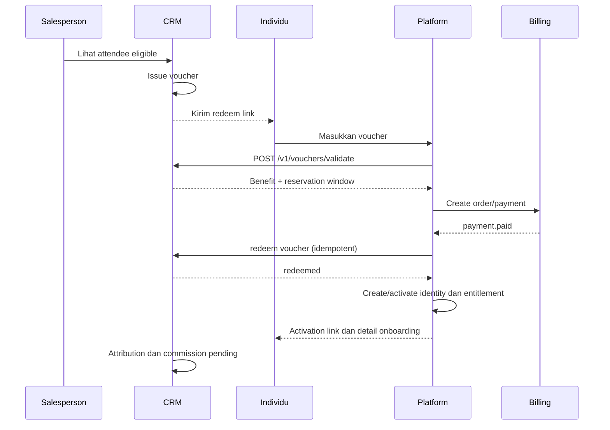
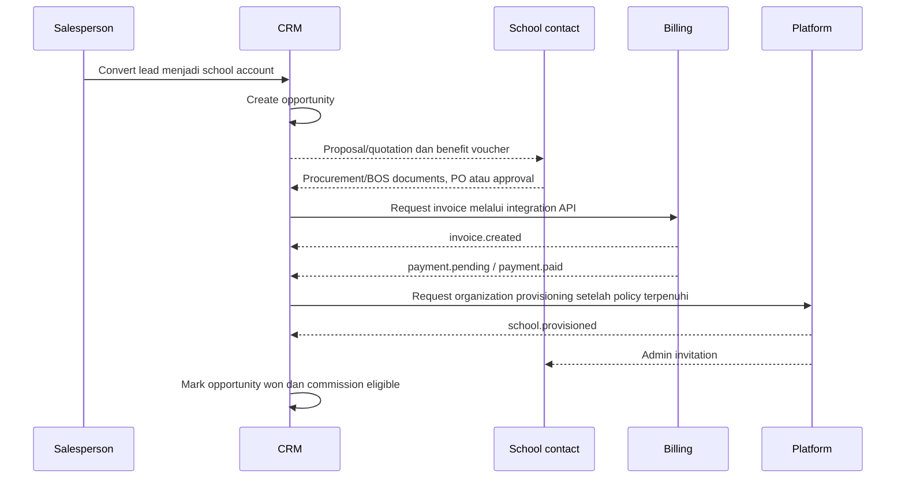

# Rancangan MVP dan Alur Bisnis

## Persona dan job-to-be-done

| Persona | Kebutuhan utama | Hak akses MVP |
|---|---|---|
| Salesperson | Menemukan lead, mengisi webinar, follow-up, memberi voucher, mengubah lead menjadi conversion | Lead milik sendiri/tim, webinar, aktivitas, voucher sesuai policy, opportunity |
| Sales manager | Memantau pipeline, approval discount, reassignment, performa tim | Scope tim, approval, reports |
| Marketing | Mengelola campaign dan webinar content | Campaign dan webinar, tanpa akses payment detail sensitif |
| Finance | Memeriksa invoice/payment/refund dan komisi eligible | Read-only financial view atau link ke billing |
| Integration operator | Memantau sync, retry, dead-letter | Operational console, tidak melihat password |

## Modul MVP

### Sales workspace

- Dashboard: task hari ini, webinar terdekat, lead overdue, voucher outstanding, opportunity stage.
- Lead list dengan filter status, source, owner, segment, last activity.
- Timeline aktivitas: call, WhatsApp, email, note, booking, attendance, voucher, payment event.
- Task dan follow-up dengan due date.

### Webinar booking

- `webinar_event`: judul, deskripsi, host, provider URL, timezone, start/end, kapasitas, status.
- `webinar_session`: satu jadwal konkret dari event.
- Public booking page menggunakan token publik, bukan ID internal berurutan.
- Reminder configurable; provider webinar dapat Zoom, Meet, atau link eksternal.
- Attendance dapat diinput manual, CSV import, atau callback provider pada fase lanjutan.

### Campaign dan voucher

- Campaign menentukan target audience, eligibility, benefit, expiry, dan owner.
- Voucher dapat issued ke peserta atau account sekolah.
- Code/token unik, sulit ditebak, dan status lifecycle tercatat.
- Policy mencegah re-use, over-limit, kombinasi benefit yang tidak diizinkan, dan voucher setelah revoke.

## Funnel individu



Aturan penting:

- Buyer dan beneficiary boleh berbeda, misalnya orang tua membayar untuk murid.
- Jika total order nol, tetap buat `zero_value_order`.
- Redemption final hanya setelah order/payment memenuhi policy.
- Activation link dibuat oleh platform, bukan dikirim sebagai password oleh CRM.

## Funnel sekolah



Voucher sekolah tidak otomatis membuat murid/guru. Ia melekat pada `school_account` atau `opportunity`, kemudian benefit di-snapshot pada quotation/order. Jumlah seat dan durasi harus disetujui sebelum provisioning.

## State machine utama

### Booking

```text
registered -> confirmed -> attended
                       \-> no_show
```

### Voucher

```text
draft -> issued -> reserved -> redeemed
              |       |
              |       +-> available (reservation expired)
              +-> revoked
issued/available -> expired
```

### Individual conversion

```text
lead -> webinar_registered -> attended -> voucher_issued
     -> checkout_started -> payment_pending -> paid -> activated
```

### School opportunity

```text
lead -> qualified -> discovery -> proposal_sent -> procurement_bos
     -> approval_pending -> invoice_issued -> payment_pending
     -> paid -> provisioning -> won
```

## Acceptance criteria MVP

- Booking menolak sesi penuh dan duplicate registration berdasarkan policy.
- Attendance dapat diubah hanya oleh role yang berwenang dan tercatat di audit log.
- Issue voucher bersifat idempotent untuk pasangan `campaign_id + attendee_id`.
- Reserve voucher memiliki TTL dan dapat dilepas otomatis.
- Redeem tidak dapat terjadi dua kali untuk voucher single-use.
- Payment webhook duplicate tidak menggandakan activation atau komisi.
- Sekolah dapat tetap berada pada `procurement_bos` tanpa membuat akun belajar aktif.

