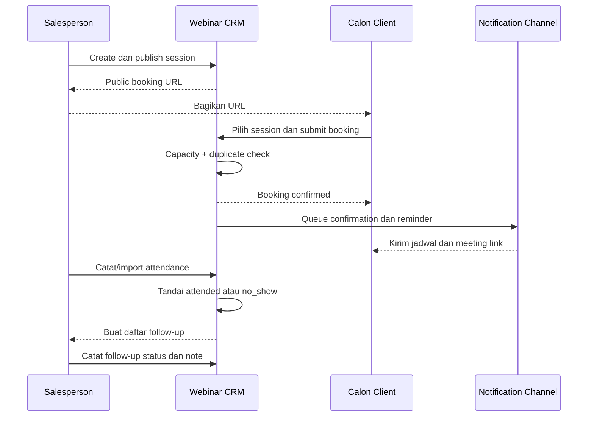

# Rancangan MVP Webinar dan Alur Bisnis

## Persona

| Persona | Kebutuhan utama | Hak akses MVP |
|---|---|---|
| Salesperson | Menjadwalkan webinar, mengundang calon client, memantau peserta, dan follow-up | Sesi serta peserta milik sendiri/tim sesuai scope |
| Sales manager | Memantau volume, attendance, dan follow-up tim | Read team scope, reassign owner, report |
| Marketing/host | Membantu menyiapkan topik dan materi webinar | Kelola event/session yang diberikan |
| CRM admin | Mengelola role, template, dan konfigurasi dasar | Full configuration dan audit access |
| Calon client | Memilih jadwal dan menerima informasi webinar | Public booking, cancel, dan reschedule melalui token aman |

Finance dan integration operator tidak diperlukan sebagai role MVP selama payment dan integrasi lintas sistem dipending.

## Modul MVP

### Webinar management

- Event/template: judul, deskripsi, audience, host, dan materi ringkas.
- Session: tanggal, waktu, timezone, durasi, kapasitas, meeting URL, dan status.
- Status session: `draft`, `published`, `full`, `completed`, `cancelled`.
- Publish menghasilkan public booking URL yang tidak mengekspos ID berurutan.

### Public booking

- Calon client memilih session yang published dan masih tersedia.
- Form minimum: nama, email atau nomor telepon sesuai kanal, tipe calon client, dan consent.
- Booking memeriksa kapasitas dan duplicate registration secara atomik.
- Participant menerima confirmation serta management link untuk cancel/reschedule.
- Anti-spam memakai rate limit dan honeypot/CAPTCHA hanya bila abuse terbukti.

### Reminder dan notification

- Confirmation dikirim setelah booking berhasil.
- Reminder memiliki jadwal configurable, misalnya H-1 dan H-1 jam.
- Delivery status terlihat: `pending`, `sent`, `failed`, `cancelled`.
- Session yang dibatalkan menghentikan reminder lama dan mengirim pemberitahuan pembatalan.

### Attendance

- Input manual per participant.
- Bulk import CSV sebagai jalur operasional awal.
- Status: `unknown`, `attended`, `no_show`.
- Provider callback otomatis dipindahkan ke fase setelah MVP kecuali provider sudah menyediakan integrasi yang sangat sederhana.

### Follow-up salesperson

- Daftar peserta difilter berdasarkan attendance dan owner.
- Follow-up status: `not_started`, `planned`, `contacted`, `closed`.
- Task memiliki due date, owner, note, dan outcome ringan.
- MVP tidak mengubah follow-up menjadi opportunity, voucher, atau payment.

## Journey utama



## Reschedule dan cancellation

```text
confirmed -> cancelled
confirmed -> rescheduled -> confirmed pada session baru
```

- Reschedule memesan kursi session baru lebih dulu dalam transaction yang sama sebelum melepas kursi lama.
- Cancellation mengurangi reserved seat dan membatalkan reminder yang belum dikirim.
- Session cancelled tidak menerima booking baru.
- Meeting URL hanya ditampilkan kepada participant yang memiliki management token atau melalui notification yang sah.

## State utama

### Session

```text
draft -> published -> full -> completed
              |          |
              +----------+-> cancelled
```

Status `full` dapat dihitung dari kapasitas, tetapi tetap tampil sebagai kondisi operasional.

### Registration

```text
confirmed -> attended
     |      -> no_show
     +-> cancelled
     +-> rescheduled
```

### Follow-up

```text
not_started -> planned -> contacted -> closed
```

## Acceptance criteria MVP

- Hanya session `published` yang dapat dibooking.
- Booking concurrent tidak dapat melebihi kapasitas.
- Duplicate submit dengan data dan session sama tidak membuat record kedua.
- Waktu ditampilkan konsisten sesuai timezone session dan participant.
- Cancel/reschedule memerlukan management token yang sulit ditebak.
- Reminder tidak dikirim kepada registration yang cancelled atau session yang cancelled.
- Import attendance menampilkan preview dan error per row sebelum commit.
- Koreksi attendance tercatat dalam audit log.
- Salesperson dapat melihat dan mengekspor peserta serta menyelesaikan follow-up.
- Tidak ada dependency payment, voucher, atau platform provisioning dalam end-to-end test MVP.

