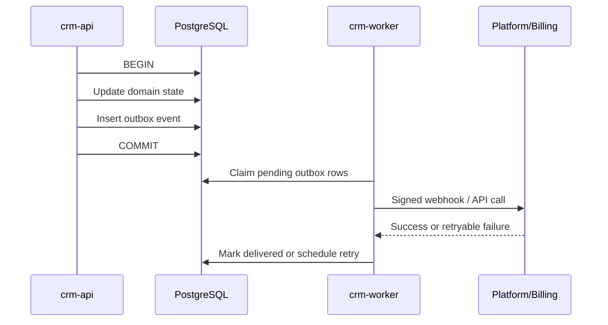
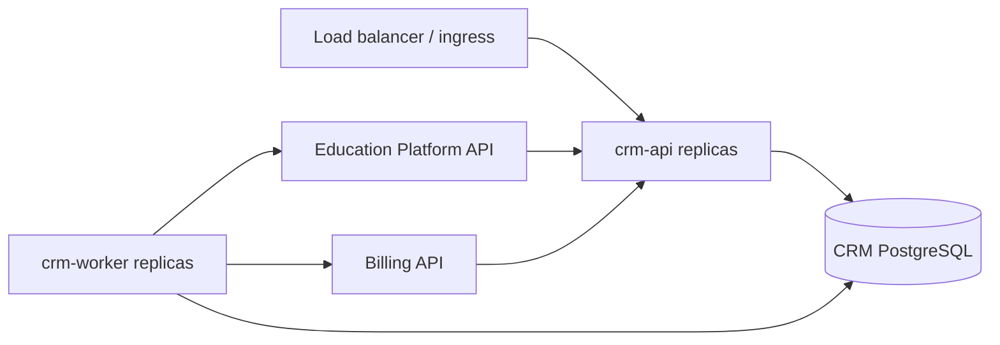

# Arsitektur Implementasi Go

## Keputusan ringkas

Backend CRM MVP dibangun sebagai **modular monolith berbasis Go**. Satu repository dan satu database CRM digunakan untuk menjaga delivery cepat, sementara boundary domain tetap tegas agar modul dapat dipisahkan kemudian tanpa menulis ulang keseluruhan sistem.

Deployment awal memiliki dua proses dari codebase yang sama:

```text
crm-api      -> REST API untuk sales workspace, public booking, dan integration endpoint
crm-worker   -> reminder, expiry, outbox delivery, webhook processing, dan reconciliation
```

Command migrasi database boleh menjadi binary ketiga atau dijalankan oleh migration tool di pipeline deployment. Portal dokumentasi Node.js yang ada bukan bagian dari runtime produk CRM.

## Mengapa modular monolith

- Kebutuhan MVP masih bergerak dan satu tim perlu mengubah beberapa domain secara bersamaan.
- Transaksi penting seperti issue voucher dan pencatatan outbox lebih sederhana dalam satu PostgreSQL transaction.
- Operasi hanya membutuhkan dua workload, bukan banyak service, queue, dan deployment terpisah.
- Boundary package Go tetap memberi jalur ekstraksi untuk Voucher atau Integration bila nanti dibutuhkan.

Microservices bukan target awal. Kafka, service mesh, event sourcing, CQRS penuh, dan Kubernetes khusus CRM tidak diperlukan sebelum ada bukti volume atau kebutuhan organisasi.

## Struktur repository yang direkomendasikan

```text
cmd/
  crm-api/
    main.go
  crm-worker/
    main.go
  crm-migrate/              # optional

internal/
  lead/
  account/
  activity/
  webinar/
  campaign/
  voucher/
  opportunity/
  commission/
  integration/
  auth/
  billingclient/
  platformclient/
  persistence/
  telemetry/

migrations/
openapi/
configs/
tests/
```

Setiap package domain memiliki business rule, service/use case, interface repository yang dibutuhkan, dan transport adapter terkait. Hindari satu package `models`, `utils`, atau `services` global karena akan mengaburkan ownership.

Dependency rule:

```text
HTTP / worker handler
        |
        v
domain use case -----> repository / external-client interface
                           |
                           v
                    PostgreSQL / HTTP adapter
```

- Domain tidak mengimpor HTTP handler atau detail driver database.
- Adapter platform dan billing tidak berisi aturan voucher atau opportunity.
- Modul tidak membaca tabel milik modul lain secara bebas; akses lintas domain melalui use case yang memiliki data tersebut.
- Shared package hanya berisi concern teknis yang benar-benar lintas domain, bukan business logic campuran.

## Runtime dan request flow

### API process

Gunakan `net/http` atau router tipis yang mengikuti standar tim. Hindari framework besar bila kebutuhan hanya routing, middleware, validation, dan JSON.

Middleware minimum:

1. request dan correlation ID
2. recovery dan structured logging
3. authentication
4. authorization dan owner/team scope
5. request size limit dan rate limit untuk endpoint publik
6. timeout/deadline
7. metrics dan tracing

`context.Context` diteruskan dari HTTP request sampai query dan outbound call. Jangan menyimpan context di struct domain dan jangan menjalankan pekerjaan panjang setelah request selesai; masukkan pekerjaan tersebut ke job/outbox.

### Worker process

Worker menjalankan job dengan concurrency terbatas:

- mengirim reminder webinar
- menandai reservation atau voucher expired
- mengirim event/webhook dari outbox
- memproses inbox event dari platform/billing
- melakukan reconciliation terjadwal

Setiap handler job harus idempotent. Retry memakai exponential backoff dan jitter. Gunakan lease atau row locking agar dua replica tidak memproses job yang sama secara bersamaan.

## PostgreSQL dan transaksi

CRM memiliki satu PostgreSQL database dengan schema dan migration yang dimiliki repository CRM. Gunakan query SQL eksplisit melalui driver PostgreSQL; query generator boleh dipakai bila membantu type safety, tetapi ORM bukan syarat MVP.

Aturan transaksi:

- Satu use case membuka transaction hanya untuk perubahan CRM yang harus atomik.
- Network call ke platform atau billing tidak dilakukan di dalam database transaction.
- Perubahan state dan record outbox ditulis dalam transaction yang sama.
- Unique constraint menjadi lapisan terakhir untuk idempotency, misalnya pada `event_id`, `idempotency_key`, serta pasangan campaign dan attendee.
- Semua schema change menggunakan migration yang backward-compatible untuk rolling deployment.

## Transactional outbox dan webhook



Event masuk disimpan ke inbox/integration delivery berdasarkan `event_id` sebelum side effect. HTTP receiver mengembalikan sukses setelah event aman tersimpan, lalu worker memprosesnya. Pola ini memberi at-least-once delivery; exactly-once dicapai pada level business effect melalui idempotency dan constraint, bukan asumsi transport.

Untuk MVP, tabel PostgreSQL dapat menjadi durable job queue. Message broker baru dipertimbangkan jika throughput, jumlah consumer, atau isolation requirement melampaui pola ini.

## Integrasi platform dan billing

Interface outbound dipisah dari implementasi HTTP agar contract test dan test failure mudah dilakukan.

```go
type BillingClient interface {
    RequestInvoice(ctx context.Context, req InvoiceRequest) (InvoiceReference, error)
}

type PlatformClient interface {
    GetSubscription(ctx context.Context, id string) (Subscription, error)
    RequestSchoolProvisioning(ctx context.Context, req ProvisioningRequest) error
}
```

Contoh ini menunjukkan bentuk dependency, bukan kontrak final. OpenAPI dan event schema tetap menjadi sumber kontrak lintas sistem.

Outbound HTTP client wajib memiliki timeout, connection reuse, response size limit, retry yang selektif, dan propagasi correlation ID. Jangan retry mutating request tanpa idempotency key.

## Security dan konfigurasi Go

- Secret hanya berasal dari secret manager atau environment runtime, tidak masuk repository.
- Validasi authorization dilakukan pada use case, bukan hanya disembunyikan di UI.
- Gunakan parameterized query dan decoder JSON yang membatasi ukuran payload.
- Webhook memverifikasi signature, timestamp tolerance, dan replay protection sebelum diproses.
- Endpoint profiling/debug tidak dipublikasikan; jika dipakai, batasi ke jaringan dan role operasional.
- Proses mendukung graceful shutdown: berhenti menerima request/job baru, menyelesaikan pekerjaan aktif dengan deadline, lalu menutup database dan HTTP connection.

## Observability

Gunakan structured logger dan OpenTelemetry-compatible instrumentation. Field minimum tetap mengikuti dokumen operasi: `request_id`, `correlation_id`, `event_id`, actor, entity, outcome, dan error code.

Endpoint operasional:

```text
GET /health/live   -> proses berjalan
GET /health/ready  -> dependency kritis siap menerima traffic
GET /metrics       -> hanya untuk collector/internal network
```

Error internal dibungkus dengan konteks menggunakan `%w`, tetapi response API memakai error code stabil dan tidak membocorkan stack trace atau detail database.

## Strategi testing

| Lapisan | Fokus |
|---|---|
| Unit | Voucher eligibility, state transition, opportunity policy, commission rule |
| Repository integration | Query, migration, transaction, unique constraint, outbox claim |
| HTTP/API | Validation, auth scope, status code, idempotency |
| Contract | CRM dengan platform dan billing berdasarkan OpenAPI/event fixtures |
| End-to-end | Funnel individu dan sekolah sampai activation/provisioning |

Pipeline minimum menjalankan formatting check, static analysis, unit test, integration test dengan PostgreSQL, migration test, dan build untuk `crm-api` serta `crm-worker`. Race detection dijalankan pada suite yang relevan, terutama worker dan kode concurrency.

## Deployment MVP



API dibuat stateless agar dapat direplikasi. Worker juga dapat direplikasi karena claim job dilindungi locking/lease. Mulai dari satu replica per process bila volume kecil; scale berdasarkan metrics, bukan perkiraan.

## Kapan modul dipisahkan menjadi service

Ekstraksi hanya dilakukan jika setidaknya satu kondisi nyata muncul:

- Voucher membutuhkan SLA, load profile, atau compliance boundary berbeda.
- Integration delivery dikelola tim berbeda atau menjadi shared platform capability.
- Deployment satu modul terlalu sering mengganggu modul lain.
- Database contention terbukti melalui metrics dan profiling.
- Domain perlu digunakan oleh beberapa produk dengan lifecycle independen.

Jika belum ada kondisi tersebut, modular monolith tetap menjadi arsitektur target yang valid, bukan solusi sementara yang gagal.

## Urutan implementasi awal

1. Tetapkan Go module, layout `cmd`/`internal`, lint/test pipeline, dan migration workflow.
2. Implementasikan auth/RBAC, lead/account, webinar, dan public booking.
3. Tambahkan campaign/voucher beserta unique constraint dan state machine.
4. Tambahkan outbox/inbox worker dan contract adapter platform/billing.
5. Implementasikan funnel individu, opportunity sekolah/BOS, lalu reconciliation.
6. Review kebutuhan ekstraksi service hanya setelah hardening dan data operasional tersedia.

