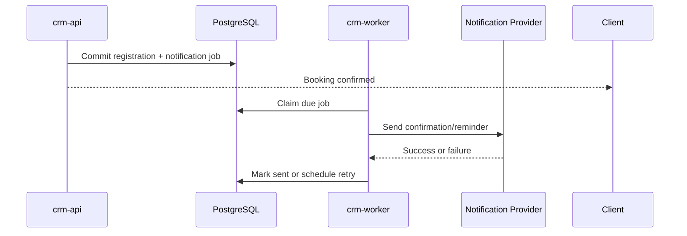
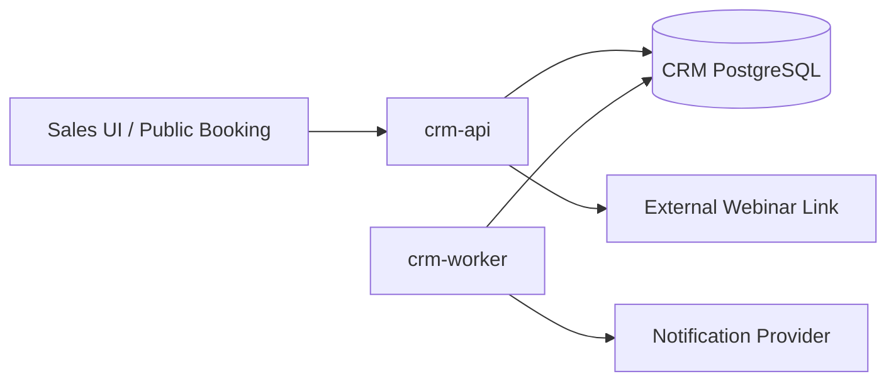

# Arsitektur Implementasi Go

## Keputusan ringkas

Backend Webinar-first MVP dibangun sebagai **modular monolith berbasis Go** dengan satu PostgreSQL database. Codebase menghasilkan dua process:

```text
crm-api      -> internal salesperson API dan public booking API
crm-worker   -> confirmation, reminder, retry, cleanup, dan reconciliation ringan
```

Portal dokumentasi Node.js di repository ini bukan bagian dari runtime produk CRM.

## Struktur repository yang direkomendasikan

```text
cmd/
  crm-api/
    main.go
  crm-worker/
    main.go
  crm-migrate/              # optional

internal/
  auth/
  webinar/
  registration/
  participant/
  attendance/
  notification/
  followup/
  audit/
  integration/              # optional extension only
  persistence/
  telemetry/

migrations/
openapi/
configs/
tests/
```

Package voucher, payment, opportunity, school procurement, dan commission tidak dibuat pada MVP.

## Dependency rule

```text
HTTP / worker handler
        |
        v
domain use case -----> repository / notification interface
                           |
                           v
                    PostgreSQL / provider adapter
```

- Domain tidak mengimpor handler atau driver database.
- Package registration meminta perubahan capacity melalui use case webinar, bukan update tabel sembarang.
- Notification adapter tidak menentukan aturan booking atau attendance.
- Hindari package global `models`, `services`, atau `utils` yang mencampur ownership.

## API process

Gunakan `net/http` atau router tipis sesuai standar tim. Middleware minimum:

1. request ID dan structured logging
2. recovery
3. authentication untuk endpoint internal
4. authorization dan team scope
5. rate limit serta request size limit untuk endpoint publik
6. timeout/deadline
7. metrics

`context.Context` diteruskan dari request ke use case, query, dan outbound call. Jangan menyimpan context pada entity atau menjalankan goroutine tanpa cancellation owner.

## Worker process

Worker menangani pekerjaan yang tidak boleh memperlambat booking:

- confirmation delivery
- reminder terjadwal
- cancellation notification
- retry transient failure
- session completion job
- reconciliation notification dan attendance
- optional outbound webhook bila ada consumer

Gunakan PostgreSQL job table dengan lease atau row locking. Mulai dengan concurrency kecil dan configurable; message broker tidak dibutuhkan untuk MVP.

## PostgreSQL dan transaksi

Aturan utama:

- Capacity check dan registration insert berada dalam transaction yang sama.
- Reschedule memesan target session dan melepas source registration secara atomik.
- Registration dan confirmation job ditulis dalam transaction yang sama.
- Unique constraint menjadi lapisan terakhir untuk duplicate policy dan idempotency key.
- Network call ke notification provider tidak dilakukan di dalam database transaction.
- Migration dibuat backward-compatible untuk rolling deployment.

Contoh transaction boundary:

```text
BEGIN
  lock webinar_session
  verify published + capacity
  find/create participant
  insert registration
  insert confirmation notification_job
  insert audit_log
COMMIT
```

## Notification delivery



Booking tetap berhasil ketika notification provider sedang bermasalah karena record dan job sudah tersimpan. Dashboard menampilkan delivery failure agar operator dapat melakukan retry aman.

## Integrasi dan future hook

MVP tidak memiliki billing client, payment webhook, voucher client, atau provisioning client. Jika consumer internal nyata tersedia, event webinar dapat ditulis ke outbox dalam transaction yang sama dan dikirim worker.

Event pertama yang paling berguna untuk fase berikutnya adalah `webinar.attendee.attended`. Stable `registration_id`, `participant_id`, `salesperson_id`, `source`, dan `campaign_reference` cukup menjadi hook tanpa business logic voucher.

## Security dan konfigurasi Go

- Secret berasal dari secret manager atau environment runtime.
- Authorization diperiksa pada use case, bukan hanya UI.
- JSON decoder memiliki payload size limit dan menolak input invalid.
- Public serta management token dihasilkan secara cryptographically secure dan disimpan sebagai hash bila digunakan untuk write action.
- Query selalu parameterized.
- API dan worker mendukung graceful shutdown.
- Profiling endpoint tidak dipublikasikan.

## Observability

Gunakan structured logger dan instrumentation yang kompatibel dengan OpenTelemetry. Field penting: `request_id`, `actor_id`, `session_id`, `registration_id`, `job_id`, outcome, error code, dan duration.

```text
GET /health/live
GET /health/ready
GET /metrics     # internal only
```

## Strategi testing

| Lapisan | Fokus |
|---|---|
| Unit | Session transition, duplicate policy, reminder schedule, attendance transition |
| Repository integration | Capacity locking, unique constraint, reschedule transaction, job claiming |
| HTTP/API | Validation, auth/team scope, public token, rate limit, error code |
| Worker | Retry, lease expiry, cancellation, duplicate execution |
| End-to-end | Publish -> booking -> reminder -> attendance -> follow-up |

Pipeline menjalankan formatting, static analysis, unit/integration test dengan PostgreSQL, migration test, build `crm-api` dan `crm-worker`, serta race test pada worker/concurrency code.

## Deployment MVP



Mulai dari satu replica API dan satu worker bila volume kecil. API stateless dapat ditambah replica setelah metrics menunjukkan kebutuhan. Worker dapat direplikasi setelah job claim teruji aman.

## Urutan implementasi

1. Inisialisasi Go module, `cmd`/`internal`, migration, CI, logging, dan health checks.
2. Implementasikan auth, webinar event/session, publish/cancel, dan dashboard dasar.
3. Implementasikan public booking, atomic capacity, duplicate prevention, cancel/reschedule.
4. Tambahkan worker untuk confirmation/reminder dan operational status.
5. Tambahkan attendance manual/CSV, follow-up, export, audit, dan hardening.
6. Evaluasi webhook atau voucher hanya setelah MVP webinar digunakan dan consumer berikutnya diprioritaskan.

